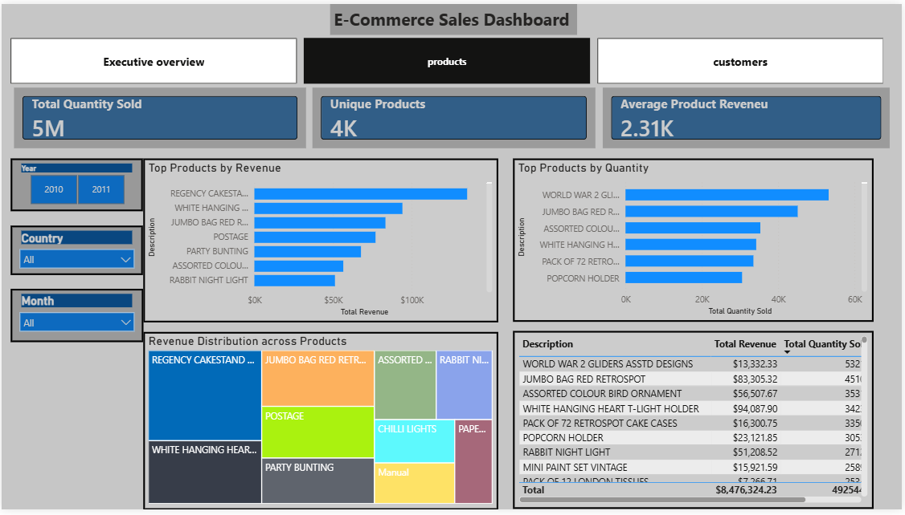
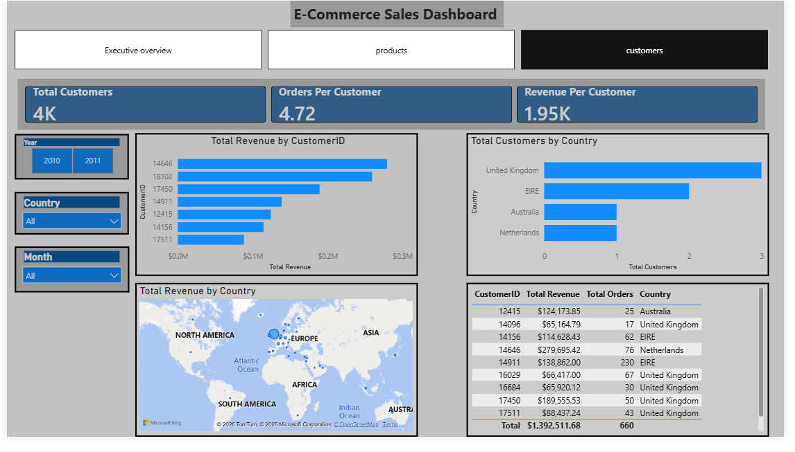

# 📊 E-Commerce Analytics Dashboard

## Overview

This project presents a professional Power BI dashboard built to analyze e-commerce business performance. The dashboard provides insights into sales trends, product performance, and customer behavior using an online retail dataset.

## Business Objectives

* Analyze overall business performance
* Identify top-performing products
* Understand customer purchasing behavior
* Monitor revenue trends across countries
* Support data-driven decision making

## Tools & Technologies

* Power BI
* DAX
* Power Query
* Data Modeling
* Data Visualization

## Dashboard Pages

### 1. Executive Overview

* Total Revenue
* Total Orders
* Total Customers
* Average Order Value
* Monthly Revenue Trend
* Revenue by Country
* Top Products by Revenue

### 2. Product Analysis

* Product Performance Metrics
* Top Products by Revenue
* Top Products by Quantity Sold
* Revenue Distribution Analysis

### 3. Customer Analysis

* Customer Revenue Analysis
* Top Customers
* Customer Distribution by Country
* Revenue Contribution Analysis

## Dashboard Screenshots

### Executive Overview

### Product Analysis

### Customer Analysis

## Key Skills Demonstrated

* Business Intelligence
* Data Analysis
* Dashboard Design
* DAX Calculations
* Data Cleaning
* Interactive Reporting
* Data Visualization
